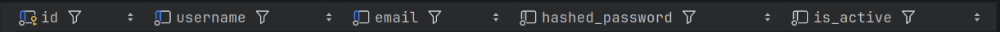
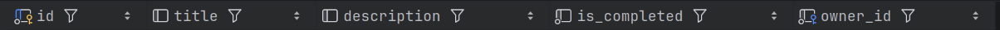

# Task-manager

Современное асинхронное приложение для управления задачами, построенное на базе FastAPI и PostgreSQL. Проект использует модульную структуру, где логика UI-страниц, REST API и сервисный слой работы с базой данных изолированы друг от друга.

##  Стек технологий

* **Backend**: Python 3.14, FastAPI
* **Database**: PostgreSQL 16+
* **ORM**: SQLAlchemy 2.0 (Асинхронный режим, `AsyncSession` через `asyncpg`)
* **Migrations**: Alembic
* **Package Manager**: uv (ультрабыстрый менеджер пакетов от Astral)
* **Containerization**: Docker & Docker Compose (полная оркестрация приложения и базы данных)
* **Frontend**: HTML5, CSS3 (Шаблонизатор Jinja2)

---

##  Основной функционал

1. **Авторизация и сессии**: Регистрация и вход пользователей с валидацией данных. Сессия сохраняется в защищённых `HttpOnly` куках (`user_id`).
2. **Двухуровневая валидация форм**: 
   * *Frontend*: HTML5-проверки на минимальную длину полей.
   * *Backend*: Проверка длины пароля (минимально 6 символов) и совпадения паролей в FastAPI. При ошибке ввода введённые логин и email не сбрасываются.
3. **Управление задачами (CRUD)**: Создание, просмотр списка, редактирование названий/описаний, удаление и быстрое переключение статуса выполнения (выполнено / в процессе) в один клик.
4. **Поиск и фильтрация**: Сквозной поиск задач по названию (регистронезависимый) с динамическим пересчётом статистики.

---

##  Структура ORM моделей

Модели данных спроектированы с использованием декларативного стиля SQLAlchemy 2.0.

### Основные сущности:

* **User**: Модель пользователя для аутентификации и связи с задачами.
  

* **Task**: Модель задачи (связана с владельцем через `owner_id`).
  

---

## Локальный запуск (Без Docker)

Если вы хотите запустить проект локально на своей машине для разработки:

### 1. Установка менеджера пакетов `uv`
Если у вас ещё не установлен `uv`, выполните команду:
```bash
curl -LsSf [https://astral.sh/uv/install.sh](https://astral.sh/uv/install.sh) | sh
```

### 2. Синхронизация окружения и зависимостей
Установите Python и все библиотеки одной командой (uv сам создаст `.venv`):
```bash
uv sync
```

### 3. Настройка окружения `.env`
Создайте файл `.env` в корне проекта и заполните его локальными данными:
```env
DB_USER=
DB_PASSWORD=
DB_HOST=
DB_PORT=
DB_NAME=
```

### 4. Локальные миграции Alembic
* **Создание новой миграции** (при изменении моделей):
  ```bash
  uv run alembic revision --autogenerate -m "Описание изменений"
  ```
* **Применение миграций**:
  ```bash
  uv run alembic upgrade head
  ```

### 5. Запуск сервера разработки
```bash
uv run main.py
```

---

## Быстрый старт через Docker Compose (Рекомендуемый способ)

Контейнеризация позволяет поднять всю инфраструктуру (FastAPI-приложение + Базу данных PostgreSQL) одной командой без необходимости устанавливать что-либо локально.

### 1. Подготовка файла окружения `.env`
Создайте файл `.env` в корневой директории проекта. Для работы внутри Docker-сети укажите следующие параметры:
```env
DB_USER=
DB_PASSWORD=
DB_HOST=
DB_PORT=
DB_NAME=
```
*(Внутри Docker-сети контейнер приложения `app` будет автоматически связываться с базой по имени сервиса `db`).*

### 2. Запуск контейнеров
Запустите сборку образов и старт всех сервисов в фоновом режиме:
```bash
docker compose up -d --build
```

### 3. Применение миграций внутри контейнера
Так как при первом запуске база данных будет пустой, необходимо применить миграции Alembic напрямую в работающем контейнере приложения `app`:
```bash
docker compose exec app uv run alembic upgrade head
```

### 4. Доступ к сайту
После выполнения миграций приложение станет доступно в вашем браузере по адресу: **[http://localhost:8000](http://localhost:8000)**

---

## Фронтенд (UI)

* **HTML**: Шаблоны страниц находятся в папке `src/templates` и используют синтаксис Jinja2 для динамического отображения данных, вывода ошибок и сохранения значений полей.
* **CSS**: Стили и кастомное оформление интерфейса расположены в папке `src/static/css`.
